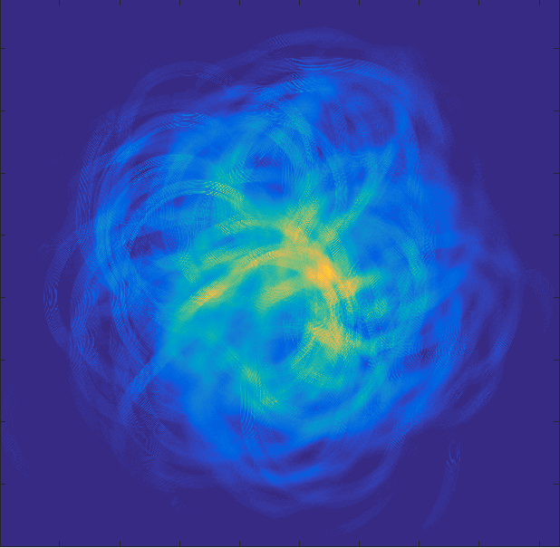

# SegyIO Demo
---

#### The Dataset

- **13.3 TB** of real 3D marine data
- **155** files, ranging from **1 GB** to **380 GB**
- **920** square kilometer source region
- **191,019** shots, resulting in  **~1,489,948,200** traces

#### Scanning

    julia> using SegyIO, PyPlot, JLD

    julia> s = segy_scan("/data/slim/data/WesternGeco/3D_Coil_data/common", "WG_Columbus_Geco_Eagle", ["GroupX"; "GroupY"], chunksize = 40*1024)

    julia> s = load("/scratch/slim/shared/klensink/SegyIO/WG_scan.jld", "s");

    julia> lookup_table_size = Base.summarysize(s)/1000^2
    110.791044

- Takes **4** hours when distributed over **8** workers
- Lookup table is an **8 e-6** reduction in memory

#### Quick Source Geometry

Since source locations were tracked during scanning, they are stored in the container and are already in memory.

    julia> srcs = get_sources(s)./100;

    julia> figure(1); scatter(srcs[:,1], srcs[:,2], marker="."); xlim(extrema(srcs[:,1])); ylim(extrema(srcs[:,2] ))
    PyObject <matplotlib.collections.PathCollection object at 0x7fff40ddb450>

#### Define a source region
We can use the scanned metadata stored in the container to find blocks of interest. In this example I'll pretend I am interested in all the shots that were fired within 100 meters of the center of the aquisition region. 

First define this region, and a function that will determine whether a coordinate pair is within the region.

    julia> center_x = mean(extrema(srcs[:,1]));
    6.78304095e7

    julia> center_y = mean(extrema(srcs[:,2]));
    3.005502e8

    julia> region_size = 100
    100

    julia> x_region = (center_x - region_size, center_x + region_size)
    (6.77804095e7, 6.78804095e7)

    julia> y_region = (center_y - region_size, center_y + region_size)
    (3.005002e8, 3.006002e8)

    julia> inregion(limx, limy, x, y) = (limx[1] < x < limx[2]) && (limy[1] < y < limy[2])
    inregion (generic function with 1 method)

We can map this function to the source locations to find which blocks have sources within the region.

    julia> blocks = find(map((x,y) -> inregion(x_region, y_region, x, y), srcs[:,1], srcs[:,2]))

    figure(1); scatter(srcs[blocks,1], srcs[blocks,2], marker="x");

#### Out of Core Metadata Collection

Now that we have determined which blocks correspond to shots in the region, we can query the out of core data for traceheader fields. In the case below I am only collecting receiver locations from all the traces constrained by `blocks`.

    julia> trace_headers = read_con_headers(s, ["GroupX"; "GroupY"], blocks, prealloc_traces = 1000000)

    julia> rx = get_header(trace_headers, "GroupX");

    julia> ry = get_header(trace_headers, "GroupY");

    julia> figure(2); scatter(rx,ry, 0.1, marker=".");
    julia> figure(2); scatter(srcs[blocks,1], srcs[blocks,2], marker="x")

#### Direct Out of Core Data Access

Indexing the container, `s`, loads the underlying data corresponding to the block index. Loading all of the traces associated with one of the shots in the region is as simple as indexing with that shot number. 

    julia> shot = s[blocks[1]]

The data is brought into memory as an array, so any method applicable to the data type can be used. Below I am plotting the data, and highlighting the receiver locations in the acquistion map.

    julia> shot_src = srcs[blocks[1],:]

    julia> shot_rx = get_header(shot, "GroupX");

    julia> shot_ry = get_header(shot, "GroupY");

    julia> figure(3); imshow(Float32.(shot.data), vmin = -1, vmax = 1, cmap = "binary")

    julia> figure(2); scatter(shot_src[1], shot_src[2],100, marker="x", color = "k");

    julia> figure(3); scatter(shot_rx, shot_ry, 1, marker="o")

The ability to navigate or sort the dataset as if it is a Julia object means it's easy to load arbitrarily complex subsets of the data set. 

    julia> radius = 5000; offset = 1000

    julia> incircle(x0, y0, radius, x, y) = sqrt((x - x0)^2 + (y - y0)^2) <= radius

    julia> blocks = find(map((x,y) -> incircle(center_x, center_y, radius, x, y) && 
                       ~incircle(center_x+offset, center_y+offset, radius, x, y), srcs[:,1], srcs[:,1]))

    julia> figure(1); scatter(srcs[blocks,1], srcs[blocks,2], marker="x")

