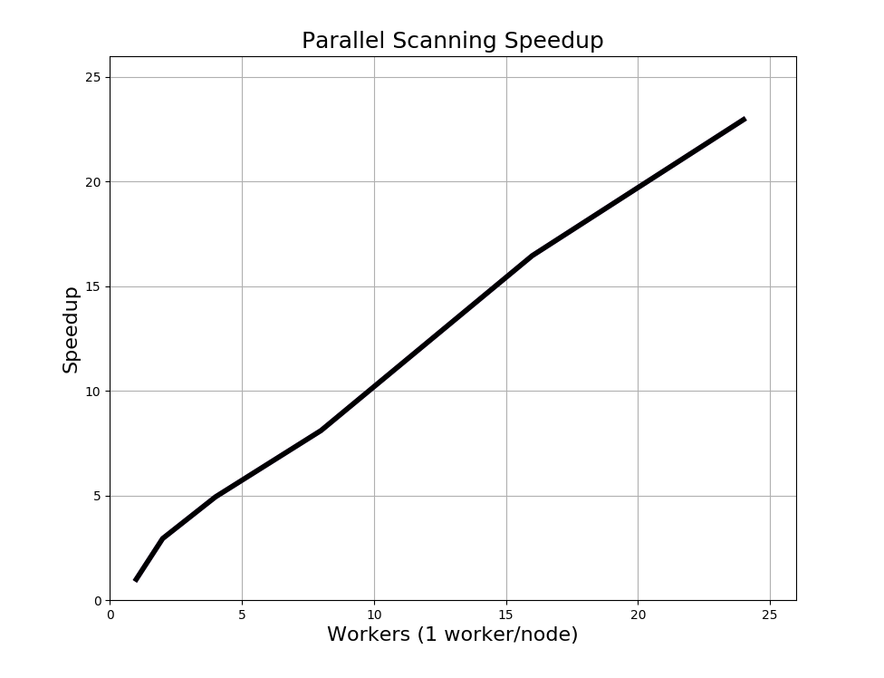

# SegyIO.jl

## Purpose
SegyIO is a Julia package for reading and writing SEGY Rev 1 files. In addition to providing tools for reading/writing entire files, SegyIO provides a parallel scanner that reduces any number of files into a single object with direct out-of-core access to the underlying data. The `SeisCon` object created from a scan tracks trace locations and metadata, allowing you to use the SEGY files as a database without any modification.

The package's three goals are too:

* Read and write SEGY data, and provide an easy to use container for the data in the Julia environment. 

* Out of core scanning capabilities to allow working with files and/or datasets that are too large for memory.

* Lightweight and fast enough that the same code works for large and small datasets.

## Design

The package naturally splits into three parts: reading, writing, and scanning

### Reading

A working knowledge of the the [SEGY format](https://www.seg.org/Portals/0/SEG/News%20and%20Resources/Technical%20Standards/seg_y_rev1.pdf) will be necessary. 

The package provides two avenues for reading data from a SEGY file. The first of which is reading directly from a file with no a priori information. The reader will use the metadata from the file header to decide how to interpret the rest of the file. This method requires reading each file individually and doesn't allow random access. The second method is to use a SeisCon object to read pre-determined blocks of data out of a file. Both methods make use of the same low level reading functions to interpret blocks of data into trace headers and traces, they just change how that block of data is found. 

`segy_read` is the highest level reading function for reading directly from a file. This function is necessary because it decides whether the stream that will be read will be a file pointer or an IOBuffer. The use of IOBuffers are key to SegyIO's performance. A choice was made to favour performance when reading a sebset of the trace headers, which requires unordered reading. All of this jumping around is much faster when done with an IOBuffer. In almost all cases the IOBuffer should be used.

`read_file` and the downstream reading functions were carefully designed to be agnostic of the stream type, in the hopes that it would be easy in the future to plug in some other stream like an AWS bucket. 

The design of the reader is simply:

* Read the file header to get the data sample format, check for the fixed length trace flag, and get the number of samples.
* Calculate the number of traces in the file
* Pre-allocate memory for the headers and for the data
* Get the trace header `bytes_to_samples` dict
* Read each trace
* Form and return a SeisBlock
* Hierarchy:  `Read File < Read FileHeader & Read Trace < Read Trace Header & Trace Data`

A `SeisBlock` is an in core data container that contains the fileheader, trace headers, and data from a read. While trace headers are kept seperate, the data is returned as an array to make it easier to work with, since array operations are so common. Methods are provided to get metadata vectors out of the collection of trace headers.

Reading using a SeisCon object skips most of the steps above because all of the necessary information was collected during the scan and stored within the SeisCon object `s`. For example, say you have determined that you want to read the 10th block of data out of the SeisCon object. You can do this by simply calling  `s[10]`, which is the same thing as `read_con(s, 10)`. This will use the 10th BlockScan in `s` to seek to the starting byte of the correct file, and read until the end byte of the block. 

### Supported Data Types 

DSF 5 are IEEE Float32s (Primitive type in Base Julia) so they are preffered.

DSF 1 are IBM Float32s, and are supported only for reading. A conversion was taken from Seismic.jl to convert IBM to IEEE. If for some reason you need to write IBM Float32s you should try to find a C function to do the converstion, I couldn't find anything in Julia. 

### Writing

Most of the work for the writing is done by making use of the reading code. The writer is bare-bones and very simple. In order to achieve this, the writer is designed to take a `SeisBlock` as input, and write to disk. The SeisBlock type was designed during the reading stage to very closely resemble the SEGY format, so writing a `SeisBlock` instance to disk is trivial.

Because all of the work for the writer was offloaded to the construction of `SeisBlock` instances, a variety of methods are provided to facilitate creating `SeisBlock`s from generated data and populating the headers.

The created files have been tested to be compatible with SEGYMAT. We once sent some files to SLB and they had some troubles reading a few files out of the hundreds we sent. It was never really clear whether the problem was on our end or thiers, so if it is later found that SEGY files generated by SegyIO are incompatible with other readers, you are going to have to track down what the writer overlooks.

### Scanning

Scanning is what sets this package apart from other readers/writers. The scanner was added so that the data loading section of code doesn't need to be rewritten when scaling up. In order to do this the scanning needed to be seamlessly parallel and out of core. This would allow reading from any number of files, and impose no file size limit. Once a dataset has been scanned, the resulting `SeisCon` acts as a database that you can use to get out-of-core access the the underlying data in the SEGY files without duplicating any data.

In a similar style to `segy_read`, `segy_scan` is a high-level function that dispatches `scan_file` in parallel over all the matched files that will be scanned. Since `scan_file` handles the out of core aspect, this combination provides a parallel way to scan any number of files.

The option to specify a fixed block size is a legacy from the MATLAB version of the code, and is particularly useful when working with data where all shot gathers have the same number of traces, or your workflow doesn't require complete shot gathers. We quickly found that having a fixed block size doesn't really work with real data because you are very likely to have missing traces. Inorder to deal with this I added the automatic shot detection option that is now the default. This method is implemented at the chunk level by analysing the source location metadata of all traces in the chunk to find contiguous traces with the same source location. These are inferred to be a common shot gather, and are marked to be included in the same block. It would be possible at this point to give the user an option to group more than one shot into each block. 

This feature is implemented by the `delim_vector` function when it is applied to a vector of the SourceX and SourceY values. The function works similarly to the bisection method for root finding, and is performant on vectors that include millions of sources.

### Out-of-Core Scanning

Chunk size, passing remaining traces, show some pictures

The chunk size keyword is used to determine how much of the file is loaded into the in memory IOBuffer at a time, and are processed sequentially for the entire file. For each chunk, block boundaries are determined, then each block is scanned sequentially. It can't really be known if the last block in a chunk is complete unless it is at the end of the file, so the remainder is always prepended to the next chunk.

There is a performance benefit to working with a larger chunk size, especially in highly parallel scans, but the main point of setting the chunk size is to cap the peak memory use of the scanner.

Hierarchy: `Scan File < Scan Chunk < Scan Block < Scan Trace`

### Parallelism 

Files are scanned and read independently, so the natural choice for parallelism was to distribute over files. This has been implemented in both `extract_con_headers` and `segy_scan`, but not yet `segy_write` or `segy_read`. To implement it for `segy_read`, I would once again just distribute the reading task over all files, then collect the results on master and merge the returned blocks to form one final block that encompasses the entire data set. There is a use case for this, so it should be implemented at some point, but in most cases it would be simpler to just have the worker access the data it needs from a SeisCon. 

In terms of the scanner, the obvious downside of distributing over files is that you cannot use more workers than there are files. This becomes more of a problem if the dataset you wish to work with consists of only a few files, but they are large. Assuming a fixed block size is chosen, and that the fixed length trace flag is set, it would be possible to break an individual file into chunks and scan each piece independantly. This would have to be added after the file header has been read, and you would need to be careful to ensure that the chunk boundaries you choose are some integer multiple of the block size, but it is a pretty simple extension. Nothing like this has been added so far because no one is using the fixed block size. 

Automatic shot detection creates a few problems for scanning a single file in parallel. The method needs to be more flexible, so it makes some decisions on the fly. Until a chunk is read, there is no way of knowing where the last block will fall. It should be assumed that the chunk will not contain an integer multiple of blocks, so there are often some remaining traces at the end of a chunk that must be pushed to the start of the next chunk. As long as a single worker is scanning each file this isn't really a problem, but it starts to create a headache if there are multiple workers per file. A first implementation of this could try to pass any remaining traces to the worker processing the next chunk with the assumption that they are guaranteed to be the first traces from the next block. With careful book-keeping this should work, but you'll also need to consider the performance implications of accessing the same file from multiple workers. This should be less of a concern on the cloud assuming that the chunks are seperate buckets. 

Scaling tests show that this process scales linearly. 

---
## Future Work

* Check for extended textual headers after reading the first file header at the start of read_file, if found you will need to read_fileheader again and then modify `start_byte` to point to the end of the file headers.

* Support other revisions by just changing the `bytes_to_samples` dict. Possible solution was to use a global `SEGY_REVISION` variable that would decide which `bytes_to_sample` dict is used by the reader.

* If only reading a few headers, it would be more efficient NOT to use BinaryTraceHeaders and instead either return some other flexible structure or an array. The array method was used in `extract_con_headers`, but this could be better integrated into the rest of the code. 

* Add ability to write to extended textual headers.

* Parallel `segy_read` and `segy_write`

* Support non-fixed trace length files by checking and updating `ns` after each trace read in the next trace's header.

* Provide a keyword option to scan more than one shot into a block.

## Transition to the Cloud

Eventually SegyIO needs to transition to working with data that is stored on the cloud rather than a file system. The current Local-Local setup was designed with this in mind, so in this section I am just going to try and summarize how I envisioned this transition happening. I am going to assume that the SEGY files are stored in AWS S3 buckets because that is what I am most familiar with, but I think this workflow should be provider agnostic.

### Reading

Reading data should be the simplest piece of the code to transition to the could. As it stands, everything down stream of `read_file` is setup to work on an in memory byte stream, so presumably all that would will need to figure out is how to get the SEGY file from an AWS bucket into an IOBuffer. If the entire file is stored in one bucket it should be as simple as something like `read_file(IOBuffer(S3.get_bucket(foo)), true)`.

If the file is in multiple buckets, you will need to create some routine to reconstruct the entire file, but AWS provides a service like this.

Without random access, the current method of extracting metadata without reading the traces on the cloud will not work. A possible solution is to store all or some of the metadata in seperate objects that can accessed more easily. A natural extension of this would be setting up some kind of database that stores all of the metadata, however this kind of gets away from the whole point of SegyIO, which was to turn the SEGY files themselves into a database.

### Writing

Similar to the reader, this should not be a difficult transition. In the current Local-Local setup the writer constructs creates the output as a byte stream and simply writes it to a file. In a Cloud-Cloud setup the writer should just dump this byte stream into S3 buckets, probably after breaking it up into manageable pieces.

### Scanning 

Local-Local scanning is already covered, and while a solution for Cloud-Cloud should work for Local-Cloud, it hasn't been seriously considered because it would require streaming all of the data to the local machine. The Local-Local solution heavily depends on random access to the file, which will be a key hurdle to overcome when transitioning to the cloud. Not being able to skip reading the trace data and jump right to the next trace header would require streaming the entire dataset to complete a scan. At some point, the extra cost of storing the data on EFS may be worth the speedup for atleast scanning. 

Assuming that you don't have random access to the data, individual buckets become the finest grain control you have for accessing the data. Creating these buckets to be as small as reasonably possible could still grant you some form of psuedo-random access. If that is the case, a file would be an ordered collection of buckets, and you could still parallelize over files by treating a group of buckets as a chunk. You could re-use the method from the "Reading" section above to collect a group of buckets into a memory buffer, and then process the data in memory.

The results from a scanned block would need to return a modified `BlockScan` object that contains information for which buckets need to be loaded to get the block. AWS S3 supports byte range requests so keeping track of the starting byte and bucket, the ending byte and bucket, and all the intermediate buckets you could read the data from the SeisCon just as it is setup in the Local-Local code.

An alternative method Henryk and I have discussed would be to save each block as a bucket, then the `BlockScan` object only needs to track the bucket. This would probably be more performant to use, and definitely more  simple to implement, but it would require dublicating the dataset on the cloud. For very large datasets, the cost of this storage could make it unfeasible, however if it really is that much faster and the data is accessed often, it might make up for the CPU time wasted loading data with the slower method.

